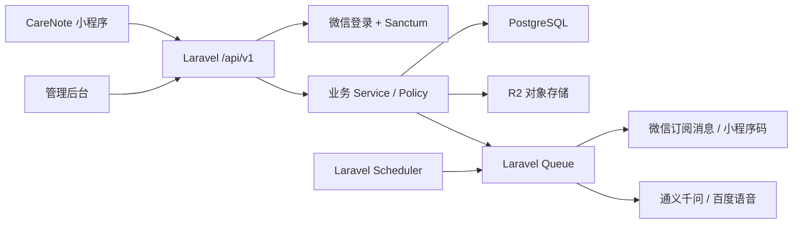
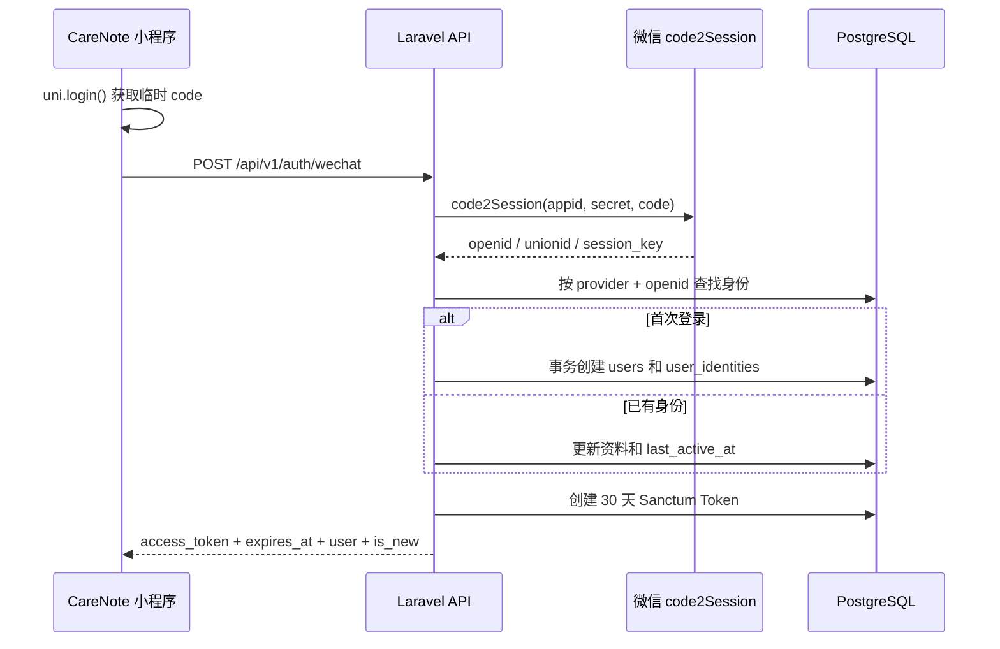

# CareNote 云开发迁移至 Laravel 实施方案

## 1. 文档目标

将 CareNote 小程序当前依赖的微信云函数、云数据库和云存储能力，分阶段迁移至现有 Laravel 后台。

目标架构：

- Laravel API 承接业务接口和权限校验。
- PostgreSQL 作为业务数据唯一事实源。
- Cloudflare R2 承接用户文件和公共静态资源。
- Laravel Queue 执行异步任务。
- Laravel Scheduler 执行定时任务。
- 微信、通义千问和百度语音等能力由 Laravel 服务端统一调用。
- 小程序不再直接读写云数据库或云存储。

本方案按步骤实施。每完成一个阶段，都必须完成对应验证并更新本文档状态，未通过验收不进入下一阶段。

## 2. 当前盘点结论

### 2.1 云端功能

当前项目实际包含：

- 51 个云函数。
- 28 个云数据库集合。
- 6 类定时任务。
- 24 个前端 Service。
- 至少 10 个文件直接修改云数据库。
- 微信订阅消息、小程序码、日历签名、通义千问、百度语音等外部能力。

主要业务域：

| 业务域 | 功能 |
|---|---|
| 账户 | 登录、注销、用户资料 |
| 家庭 | 创建、邀请、加入、成员绑定、退出、权限 |
| 用药 | 药品、批次、计划、服药记录、库存 |
| 就诊 | 就诊记录、检查报告、复查提醒 |
| AI | OCR、对话助手、语音识别、用药单解析、TTS |
| 权益成长 | 配额、权益、连续记录、奖励、周报 |
| 营销 | 邀请归因、二维码、埋点 |
| 内容 | FAQ、协议、更新日志 |
| 后台任务 | 提醒、漏服、过期、库存、周报、清理迁移 |

### 2.2 静态资源

资源分为三类：

1. 小程序包内资源：9 个，约 7.6 KB，主要为 TabBar 图标。
2. 官网资源：24 个，约 1.5 MB。
3. 云存储业务文件：药品图片、头像、就诊报告、健康记录、语音、AI 临时图片和分享背景等。

迁移原则：

- TabBar 和必要的小图标继续放在小程序包内。
- 官网图片、运营图片、分享背景迁移到 R2。
- 用户上传文件统一通过 Laravel 文件 API 管理。
- 云存储中的 `cloud://` fileID 必须批量下载、上传 R2，并重写数据库引用。

已发现待处理问题：

- 代码引用 `/static/weekly/weekly-share-bg-v2.jpg` 作为回退图，但当前源码中不存在该文件。
- 云存储实际对象数量无法仅通过代码确定，需要从云开发环境导出完整对象清单。

### 2.3 Laravel 后台现状

已经具备：

- 28 张云数据库映射表。
- PostgreSQL 数据结构。
- Sanctum Token 能力。
- 统一 API 响应格式。
- R2 配置和图片上传接口。
- AI 渠道、模型、调用记录和配额管理框架。

现有数据库结构测试结果：

- 测试：5 个通过。
- 断言：435 个通过。

当前缺失：

- 微信小程序登录接口。
- 家庭、药品、计划、记录等业务 API。
- CareNote 业务 Model、Policy、Service 和事务逻辑。
- Scheduler、Queue Job 和微信订阅消息服务。
- 云数据库和云存储导入命令。
- 通用文件元数据、文件归属和删除鉴权。
- 小程序 HTTP API 适配。

## 3. 目标架构



核心原则：

- 客户端不再直接读写数据库。
- `openid` 只能由后台根据微信登录凭证获取，不能信任客户端传入的 openid。
- 家庭权限统一放在 Policy 或领域 Service 中。
- 库存扣减、服药确认、权益发放等操作使用数据库事务和行锁。
- 定时任务支持幂等、`withoutOverlapping` 和 `onOneServer`。
- 第一阶段尽量兼容现有前端字段名，避免同时大规模调整页面逻辑。
- 新系统稳定前，云数据库和云存储保留只读备份。

## 4. 云函数迁移分类

### 4.1 迁移为 HTTP API

- 微信登录、注销、资料更新。
- 家庭创建、邀请预览、加入、成员绑定、退出。
- 药品、批次、计划、记录、库存、就诊 CRUD。
- OCR、用药单解析、语音识别、TTS、AI 助手。
- 权益、配额、连续记录、奖励、周报和邀请归因。
- 文件上传、受控访问和删除。

### 4.2 迁移为定时任务和队列

| 原云函数 | Laravel 实现 |
|---|---|
| `generateDailyRecords` | 每日 00:30 Command + Job |
| `markMissedRecords` | 每日 01:00 Command + Job |
| `generateWeeklyReports` | 每周一 00:30 Command + Job |
| `sendReminder` | 每小时扫描后分发 Job |
| `checkExpiredVersions` | 每日 09:00 Command + Job |
| `checkStockAlert` | 每日 09:00 Command + Job |
| `sendFollowUpReminder` | 每日 09:00 Command + Job |

所有任务统一使用 `Asia/Shanghai` 时区，并实现：

- 重复执行幂等。
- 分页或分批扫描。
- 单任务防重入。
- 多实例单节点调度。
- 消息发送失败重试。
- 可查询的执行和失败日志。

### 4.3 迁移为后台命令

以下能力不开放为普通客户端 API：

- `migrateExistingUsers`
- `migrateInviteTokens`
- `migrateMedicineVersions`
- `backfillStreaks`
- `fixStockType`
- `cleanOldEvents`
- `cleanOrphanVersions`
- `seedMedicines`
- `seedChangelogs`

### 4.4 合并或淘汰

- `checkFamilyPermission`：合并到 Policy 或领域 Service。
- `joinFamily`：由 `joinFamilyV2` 的业务规则统一承接。
- `getUsersByOpenids`：合并到家庭成员 Resource 聚合。
- `getFamilyMembers`：改为标准家庭成员 API。
- `grantEntitlementReward`：改为服务端内部领域服务。
- `updateStreaks`：改为服药确认后的领域事件或队列任务。

## 5. 分阶段实施计划

### 阶段状态

| 阶段 | 内容 | 状态 |
|---|---|---|
| 0 | 迁移方案与范围确认 | 已完成 |
| 1 | 微信登录与 API 身份体系 | 进行中 |
| 2 | 通用文件服务 | 待开始 |
| 3 | 家庭与权限体系 | 待开始 |
| 4 | 核心用药链路 | 待开始 |
| 5 | 就诊、内容和辅助模块 | 待开始 |
| 6 | AI、权益和成长体系 | 待开始 |
| 7 | 定时任务和微信能力 | 待开始 |
| 8 | 数据与资源迁移演练 | 待开始 |
| 9 | 小程序切换 HTTP API | 待开始 |
| 10 | 生产切换与云开发退役 | 待开始 |

状态只使用：

- `待开始`
- `进行中`
- `已完成`
- `阻塞`

### 阶段 1：微信登录与 API 身份体系

范围：

- 新增 `POST /api/v1/auth/wechat`。
- 新增 `POST /api/v1/auth/logout`。
- 复用并完善 `GET /api/v1/me`。
- 后台调用微信 `code2Session` 获取 openid。
- 创建或更新 `users` 和 `user_identities`。
- 签发 Sanctum Token。
- 补齐配置、错误码、接口文档和自动化测试。

安全要求：

- 不接受客户端直接提交 openid 作为登录身份。
- 微信 App Secret 仅保存在后台环境变量中。
- 登录接口增加限流。
- Token 只授予小程序所需能力。
- 记录最近活跃时间，但不记录 `session_key` 明文日志。

验收标准：

- 新用户可以通过微信 code 创建账户并取得 Token。
- 老用户可以通过 openid 找回原账户。
- 相同 code 或重复登录不会创建重复用户。
- Token 可以访问 `/api/v1/me`。
- 注销 Token 后不能继续访问认证接口。
- 相关接口文档、测试、格式检查全部通过。

#### 1.1 本阶段边界

本阶段只实现 Laravel 后台认证闭环，不切换生产小程序，也不在登录过程中创建个人家庭或“本人”档案。

原因：

- 家庭初始化属于家庭领域，应在阶段 3 通过独立领域服务实现。
- 当前小程序仍使用云开发，阶段 1 完成后不会立即影响线上登录。
- 阶段 3 完成后，再把新用户个人家庭初始化接入登录后的业务编排。

本阶段不包含：

- 小程序 HTTP Client 改造。
- 前端 Token 持久化改造。
- 家庭、成员和邀请业务。
- 账号注销和业务数据级联删除。
- refresh token。

#### 1.2 登录数据流



约束：

- `code2Session` 必须由 Laravel 后台调用。
- `openid`、`unionid` 和 `session_key` 不返回小程序。
- `session_key` 本阶段不落库、不写日志。
- `user_identities.provider` 固定为 `wechat_mini_program`。
- `user_identities.provider_subject` 保存 openid。
- 微信调用完成后再开启本地数据库事务，避免在外部网络请求期间长时间持有数据库事务。
- 首次登录并发创建发生唯一键冲突时，整个创建事务回滚，再读取已创建身份，不能留下孤儿用户。

#### 1.3 登录接口契约

接口：

```http
POST /api/v1/auth/wechat
Content-Type: application/json
```

请求：

```json
{
  "code": "wx.login 返回的临时登录凭证",
  "profile": {
    "display_name": "微信昵称",
    "avatar_url": "https://example.com/avatar.jpg"
  }
}
```

字段规则：

| 字段 | 必填 | 规则 |
|---|---|---|
| `code` | 是 | 字符串，不能为空，最大 128 字符 |
| `profile` | 否 | 对象 |
| `profile.display_name` | 否 | 字符串，去除首尾空格，最大 50 字符 |
| `profile.avatar_url` | 否 | 合法 HTTP/HTTPS URL，最大 2048 字符 |

成功响应：

```json
{
  "data": {
    "token_type": "Bearer",
    "access_token": "1|plain-text-token",
    "expires_at": "2026-08-30T12:00:00.000000Z",
    "is_new": true,
    "user": {
      "id": "01K...",
      "display_name": "微信昵称",
      "avatar_url": "https://example.com/avatar.jpg",
      "status": "active",
      "gender": null,
      "tracking_enabled": true,
      "privacy_v1_1_seen": true,
      "invite_token": null,
      "theme_id": null,
      "onboarding": null,
      "last_active_at": "2026-07-31T12:00:00.000000Z"
    }
  },
  "meta": {
    "request_id": "..."
  }
}
```

响应原则：

- API 使用后台规范字段名，不返回云数据库 `_id`、`_openid`、`nickname`、`avatar`。
- 后续小程序切换时，由前端 Service 适配新字段，不在后台长期保留两套字段。
- 新用户没有昵称时，后台生成稳定的默认展示名。
- 老用户只有在本次请求明确提交非空资料时才更新昵称和头像。

#### 1.4 当前用户接口

接口：

```http
GET /api/v1/me
Authorization: Bearer <access_token>
```

调整内容：

- 保留现有路由和认证中间件。
- 扩充 `CurrentUserResource`，返回 CareNote 用户完整基础字段。
- 每次读取不产生新的 Token。
- 状态不是 `active` 的用户不能继续访问受保护业务接口。

#### 1.5 退出接口

接口：

```http
POST /api/v1/auth/logout
Authorization: Bearer <access_token>
```

成功响应：

```json
{
  "data": {
    "revoked": true
  },
  "meta": {
    "request_id": "..."
  }
}
```

退出策略：

- 只删除当前请求使用的 Token。
- 不删除该用户其他设备的 Token。
- 不删除用户数据。
- 重复使用已撤销 Token 时返回 `AUTH.UNAUTHENTICATED`。

#### 1.6 Token 策略

- 使用 Sanctum Bearer Token。
- Token ability 固定为 `app:access`。
- 每个 Token 有效期 30 天。
- 不使用永久 Token。
- 不实现 refresh token。
- Token 过期后，小程序重新执行 `uni.login()` 获取新 Token。
- 每日清理已过期超过 24 小时的 Token。
- Token 明文只在创建时返回一次，后台数据库只保存哈希。

阶段 9 切换小程序时：

- 将真实 Token 写入现有 `tokenInfo.token`。
- 删除当前写死的 `cloud_auth`。
- 收到 401 后只允许进行一次静默重登和原请求重试，避免无限重试。

#### 1.7 微信客户端设计

后台新增专用微信小程序客户端，职责仅限：

- 调用 `https://api.weixin.qq.com/sns/jscode2session`。
- 传递 `appid`、`secret`、`js_code` 和固定的 `authorization_code`。
- 将成功响应转换为内部结果对象。
- 将微信错误码转换为领域异常。

建议超时：

- 连接超时：3 秒。
- 总超时：5 秒。
- 仅对连接失败或微信 5xx 最多重试 1 次。
- 无效 code 等业务错误不重试。

环境变量：

```dotenv
WECHAT_MINI_PROGRAM_APP_ID=
WECHAT_MINI_PROGRAM_APP_SECRET=
WECHAT_MINI_PROGRAM_TOKEN_TTL_DAYS=30
```

App Secret 不进入前端环境变量，不写入接口响应或应用日志。

#### 1.8 错误码

| HTTP 状态 | 错误码 | 场景 |
|---|---|---|
| 401 | `AUTH.WECHAT_CODE_INVALID` | code 无效、过期或已使用 |
| 401 | `AUTH.UNAUTHENTICATED` | Token 缺失、过期或已撤销 |
| 403 | `AUTH.ACCOUNT_DISABLED` | 用户状态不允许登录或访问 |
| 422 | `COMMON.VALIDATION_FAILED` | 请求字段不合法 |
| 429 | `COMMON.RATE_LIMITED` | 登录请求超过频率限制 |
| 502 | `AUTH.WECHAT_UPSTREAM_ERROR` | 微信返回无法识别的上游错误 |
| 503 | `AUTH.WECHAT_UNAVAILABLE` | 微信接口超时或暂时不可用 |
| 500 | `COMMON.INTERNAL_ERROR` | 后台配置或内部异常 |

客户端展示统一的用户友好文案，不直接展示微信原始错误信息。

#### 1.9 限流策略

- 微信登录使用独立的 `wechat-login` Rate Limiter。
- 第一版按来源 IP 每分钟最多 10 次。
- 全局 `throttle:api` 继续保留。
- 发生 429 时继续使用现有统一 API 错误包络。

后续如出现共享网络误伤，再增加设备标识或滑动窗口策略，不在当前阶段提前扩展。

#### 1.10 预计文件变更

新增：

1. `app/Http/Controllers/Api/V1/Auth/WechatLoginController.php`
2. `app/Http/Controllers/Api/V1/Auth/LogoutController.php`
3. `app/Http/Requests/Api/V1/Auth/WechatLoginRequest.php`
4. `app/Http/Resources/Api/V1/WechatLoginResource.php`
5. `app/Services/Auth/WechatMiniProgramClient.php`
6. `app/Services/Auth/WechatLoginService.php`
7. `app/Exceptions/Auth/WechatCodeInvalidException.php`
8. `app/Exceptions/Auth/WechatUnavailableException.php`
9. `tests/Feature/Api/V1/WechatAuthenticationTest.php`
10. `tests/Unit/Services/Auth/WechatMiniProgramClientTest.php`

修改：

1. `routes/api.php`
2. `routes/console.php`
3. `config/services.php`
4. `.env.example`
5. `app/Models/User.php`
6. `app/Http/Resources/Api/V1/CurrentUserResource.php`
7. `app/Providers/AppServiceProvider.php`
8. `app/Support/Api/ApiErrorCode.php`
9. `app/Support/Api/ApiExceptionRenderer.php`
10. `docs/api/openapi.yaml`

原则上不新增数据库迁移，现有 `users`、`user_identities` 和 `personal_access_tokens` 已满足阶段 1。

#### 1.11 测试清单

微信客户端单元测试：

- 正常返回 openid、unionid 和 session_key。
- 无效 code 转换为指定领域异常。
- 微信超时转换为不可用异常。
- 微信 5xx 按规则重试。
- App Secret 不出现在异常消息中。

认证接口功能测试：

- 新用户首次登录创建一个用户和一个微信身份。
- 老用户登录复用原用户。
- 同一 openid 不会创建重复身份。
- 新用户默认字段正确。
- 提交资料时正确更新昵称和头像。
- 不提交资料时不覆盖老用户资料。
- 非 active 用户不能登录。
- 登录成功返回 30 天 Token 和 `app:access` ability。
- Token 可以访问 `/api/v1/me`。
- 缺少 ability 的 Token 被拒绝。
- 退出只撤销当前 Token。
- 无效 code、参数错误、限流和微信不可用返回稳定错误包络。

执行验证：

```bash
vendor\bin\pint app/Http/Controllers/Api/V1/Auth app/Http/Requests/Api/V1/Auth app/Http/Resources/Api/V1 app/Services/Auth app/Exceptions/Auth app/Models/User.php app/Providers/AppServiceProvider.php app/Support/Api routes/api.php routes/console.php tests/Feature/Api/V1/WechatAuthenticationTest.php tests/Unit/Services/Auth/WechatMiniProgramClientTest.php
php artisan test tests/Feature/Api/V1/WechatAuthenticationTest.php tests/Unit/Services/Auth/WechatMiniProgramClientTest.php tests/Feature/Api/V1/ApiFrameworkTest.php
composer docs:api:check
```

### 阶段 2：通用文件服务

范围：

- 将现有图片上传扩展为业务文件服务。
- 支持图片和音频，按实际需求支持视频。
- 增加文件元数据表。
- 记录用户、家庭、业务用途、R2 路径、MIME、大小、哈希和原 cloud fileID。
- 提供上传、受控访问和删除接口。
- 建立旧 fileID 到新文件记录的映射能力。

安全要求：

- 客户端不能指定任意 R2 路径。
- 文件删除前检查拥有者和业务引用。
- 上传校验扩展名、MIME、大小和实际文件类型。
- 临时 AI 文件设置清理策略。

验收标准：

- 药品图片、头像、报告图片和语音可以通过统一接口上传。
- 数据库只保存稳定文件标识或稳定 URL，不保存短期签名 URL。
- 未授权用户不能读取或删除其他家庭的文件。
- 上传失败时不会留下不完整数据库记录。

### 阶段 3：家庭与权限体系

范围：

- 家庭列表、创建和修改名称。
- 邀请码生成和邀请预览。
- 加入、退出和成员绑定。
- 成员新增、修改和删除。
- `FamilyPolicy` 和统一家庭访问校验。

验收标准：

- 用户只能访问自己加入的家庭。
- 家庭成员、药品、计划、记录都通过统一家庭权限校验。
- 邀请码过期、重复加入、自我绑定和越权绑定均有明确结果。
- 家庭修改操作具备事务保护。

### 阶段 4：核心用药链路

实施顺序：

1. 药品和药品批次。
2. 用药计划。
3. 每日服药记录。
4. 确认服药、跳过、延迟和漏服。
5. 库存流水和库存原子扣减。
6. 统计、日历和家庭聚合接口。

事务边界：

服药确认应在同一业务事务内处理：

- 更新服药记录状态。
- 扣减药品和批次库存。
- 写入批次消耗明细。
- 处理库存不足信息。
- 触发连续记录更新。
- 需要时异步触发奖励和提醒。

验收标准：

- 重复确认不会重复扣减库存。
- 库存并发更新不会丢失。
- 计划变更后未来记录生成和清理符合原业务规则。
- 家庭越权访问被拒绝。
- 关键操作具备幂等测试和事务测试。

### 阶段 5：就诊、内容和辅助模块

范围：

- 就诊记录和就诊链路。
- 检验报告和报告图片。
- 复查提醒订阅。
- FAQ、协议和更新日志。
- 对话会话。
- 闹钟设置日志。

验收标准：

- 就诊、计划和成员之间的引用正确。
- 删除就诊记录时同步处理报告文件和复查订阅。
- 协议版本和用户同意记录可追溯。
- 更新日志版本过滤保持现有小程序行为。

### 阶段 6：AI、权益和成长体系

计划接入的 AI 场景：

- `chat_assistant`
- `ocr_medicine`
- `parse_medication_sheet`
- `parse_voice_plan`
- `recognize_voice`
- `speak_medicine`

需要先解决的数据结构冲突：

- 旧系统使用 `cn_user_entitlements`、`cn_quota_usage`。
- 新后台已有 `cn_user_ai_entitlements`、`cn_user_ai_usages`。

推荐方案：

- 新后台 AI 配额表作为 AI 用量唯一事实源。
- 旧权益和用量表作为迁移输入及审计存档。
- 药品、计划和家庭成员容量限制统一由 `EntitlementService` 管理。
- 不允许两套表同时扣减 AI 配额。

验收标准：

- AI 请求具备幂等、扣费、失败退款和调用日志。
- AI 供应商失败时按后台配置进行降级或切换。
- OCR 和用药单解析不长期保存敏感原文。
- 奖励发放拥有唯一来源键，不会重复发放。

### 阶段 7：定时任务和微信能力

范围：

- Laravel Scheduler。
- Queue Job。
- 微信订阅消息。
- 小程序码生成。
- 日历签名。
- 任务失败重试和监控。

验收标准：

- 重复运行任务不会重复生成记录或发送消息。
- 多实例部署不会重复调度。
- 订阅消息失败原因可查询。
- 批量任务不会一次加载全表数据。

### 阶段 8：数据和资源迁移演练

流程：

1. 导出 28 个云数据库集合。
2. 导出云存储完整对象清单。
3. 将对象全量上传 R2。
4. 生成旧 fileID 到新文件记录的映射。
5. 幂等导入 PostgreSQL。
6. 重写数据库中的文件字段。
7. 校验数量、引用、重复数据和孤儿文件。
8. 在测试环境完成至少一次全流程演练。

导入顺序：

1. `users`、`user_identities`
2. 家庭和家庭成员
3. 药品和药品批次
4. 就诊、计划和服药记录
5. 健康日志和库存流水
6. 提醒、AI、权益、周报、邀请、埋点和内容

验收标准：

- 每张表记录成功、失败和跳过数量。
- 导入命令可以安全重复运行。
- 无重复用户、重复权益账户和重复周报。
- 无非法家庭、成员、药品、计划引用。
- 所有业务文件都能访问。
- 文件迁移结果具备数量和哈希校验。

### 阶段 9：小程序切换 HTTP API

范围：

- 建立统一 HTTP Client。
- 处理 Token 注入、401、统一错误格式和请求 ID。
- 将 24 个 Service 按业务域改为 REST API。
- 清理页面和组件里的直接 `wx.cloud` 调用。
- 保留游客模式和示例数据逻辑。

验证：

- `pnpm type-check`
- 本次修改文件的 ESLint 检查
- 微信小程序构建
- 体验版完整业务回归

验收标准：

- 源码中不再直接调用云数据库。
- 业务文件不再使用 `cloud://` fileID。
- 登录、家庭、药品、计划、服药、库存、就诊和 AI 主链路通过体验版验证。

### 阶段 10：生产切换与云开发退役

推荐切换流程：

1. 发布支持新 API 和最低版本控制的小程序。
2. 等待主要用户升级。
3. 进入短维护窗口，暂停旧云端写入。
4. 执行最终增量数据和文件导入。
5. 执行生产数据核对。
6. 切换小程序至 Laravel API 和 R2。
7. 保留云数据库和云存储只读备份至少 30 天。
8. 稳定后删除云函数和云开发资源。

不建议长期双写。库存、权益、奖励和服药记录在双写情况下容易产生无法自动修复的数据差异。

## 6. 主要风险

### 6.1 旧版小程序兼容

旧版本小程序直接访问云数据库，无法由 Laravel 后台透明接管。

必须采用：

- 最低版本控制。
- 中间版本升级。
- 短维护窗口。
- 最终增量迁移。

### 6.2 云存储 fileID

数据库中保存了大量 `cloud://` fileID。迁移对象文件后必须同步重写：

- `photo_urls`
- `cover_photo_url`
- `avatar`
- `voice_url`
- `media_url`
- `lab_reports[].image_urls`
- AI 会话和临时文件中的文件引用

### 6.3 权益系统重复

新旧后台存在两套 AI 权益和用量表。编码前必须确定唯一事实源，避免重复扣费或奖励。

### 6.4 高风险事务

以下业务必须重点设计事务和幂等：

- 服药确认与库存扣减。
- 家庭加入与档案绑定。
- 邀请激活与奖励发放。
- 连续记录里程碑奖励。
- 每日记录生成。
- 周报生成和周报奖励。

### 6.5 微信订阅消息

微信订阅消息依赖用户授权次数，不能将一次授权视为永久订阅。后台需要保存待发送订阅记录和实际发送结果。

## 7. 每阶段统一工作流

每个阶段按以下顺序执行：

1. 梳理当前前端调用链和云函数实现。
2. 确认 API 契约、权限和事务边界。
3. 列出预计修改文件。
4. 获得确认后编码。
5. 执行最小相关测试。
6. 更新 OpenAPI 文档。
7. 更新本文档的阶段状态和实施记录。
8. 用户确认验收后进入下一阶段。

涉及接口、字段、数据库结构或跨模块行为变化时，必须在编码前确认。

## 8. 决策记录

| 日期 | 决策 | 状态 |
|---|---|---|
| 2026-07-31 | 采用 Laravel API + PostgreSQL + R2 + Queue/Scheduler 作为目标架构 | 已确认 |
| 2026-07-31 | 按业务域迁移，不逐个照搬云函数 | 已确认 |
| 2026-07-31 | 小程序包内 TabBar 和必要图标不迁移到远程存储 | 已确认 |
| 2026-07-31 | 不采用长期双写，使用演练、维护窗口和最终增量迁移 | 已确认 |
| 2026-07-31 | 新后台 AI 配额体系作为 AI 用量唯一事实源 | 已确认 |
| 2026-07-31 | 阶段 1 Token 有效期为 30 天，不引入 refresh token，401 时由小程序重新微信登录 | 待确认 |
| 2026-07-31 | 阶段 1 不创建个人家庭和本人档案，家庭初始化延后到阶段 3 | 待确认 |

## 9. 下一步

当前正在执行“阶段 1：微信登录与 API 身份体系”的方案确认。

阶段 1 接口契约、数据流、错误码、文件变更和测试清单已经整理完成。确认以下两项后进入编码：

1. Token 有效期采用 30 天，不实现 refresh token，401 后由小程序重新微信登录。
2. 阶段 1 不在登录事务中创建个人家庭和“本人”档案，延后到阶段 3 统一实现。
